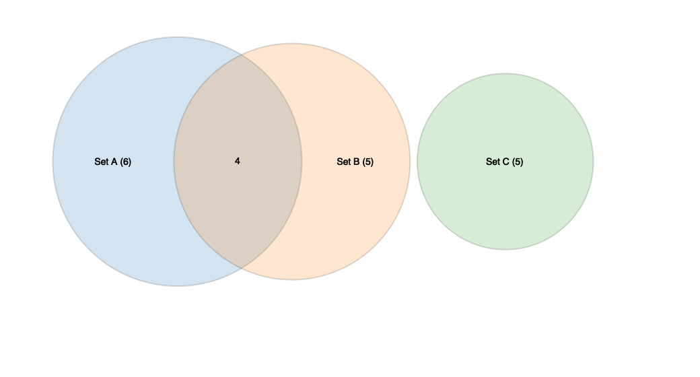
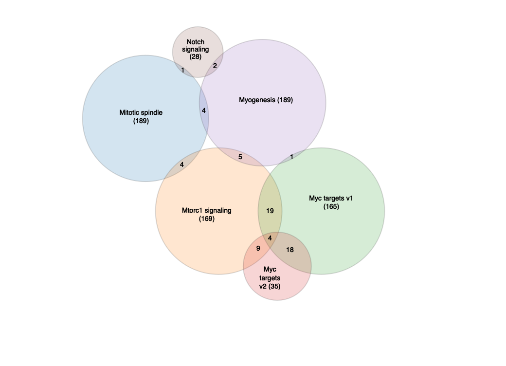

<!-- README.md is generated from README.Rmd. Please edit that file -->

# venn.r

Area proportional venn and euler diagrams through
[venn.js](https://github.com/benfred/venn.js/)

## Installation

Install the development version of the package from Github.

``` r
devtools::install_github("montilab/vennr")
```

## Examples

``` r
sets <- list("Set A" = LETTERS[1:10],
             "Set B" = LETTERS[7:15],
             "Set C" = LETTERS[20:24])

vennr(sets)
```

<!-- -->

``` r
sets <- list(list("sets"=list('Tigers'), "size"=12),
             list("sets"=list('Lions'), "size"=6),
             list("sets"=list('Bears'), "size"=20),
             list("sets"=list('Tigers', 'Lions'), "size"=3, label="Ligers"))

vennr(sets, raw=TRUE)
```

<!-- -->

``` r
str(head(genesets))
```

    List of 6
     $ Adipogenesis       : chr [1:200] "ABCA1" "ABCB8" "ACAA2" "ACADL" ...
     $ Allograft rejection: chr [1:200] "AARS" "ABCE1" "ABI1" "ACHE" ...
     $ Androgen response  : chr [1:100] "ABCC4" "ABHD2" "ACSL3" "ACTN1" ...
     $ Angiogenesis       : chr [1:36] "APOH" "APP" "CCND2" "COL3A1" ...
     $ Apical junction    : chr [1:200] "ACTA1" "ACTB" "ACTC1" "ACTG1" ...
     $ Apical surface     : chr [1:44] "ADAM10" "ADIPOR2" "AFAP1L2" "AKAP7" ...

``` r
vennr(genesets[30:35])
```

<!-- -->

``` r
vennr(genesets[25:35], labels=FALSE)
```

<!-- -->
